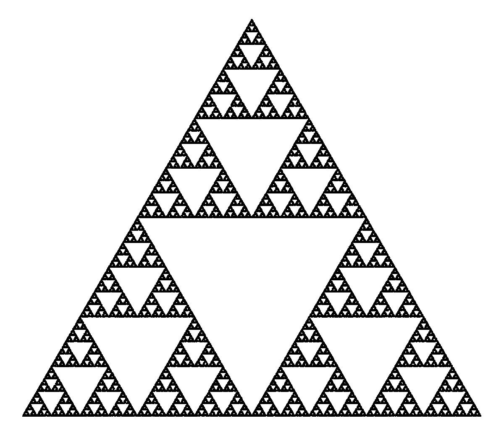
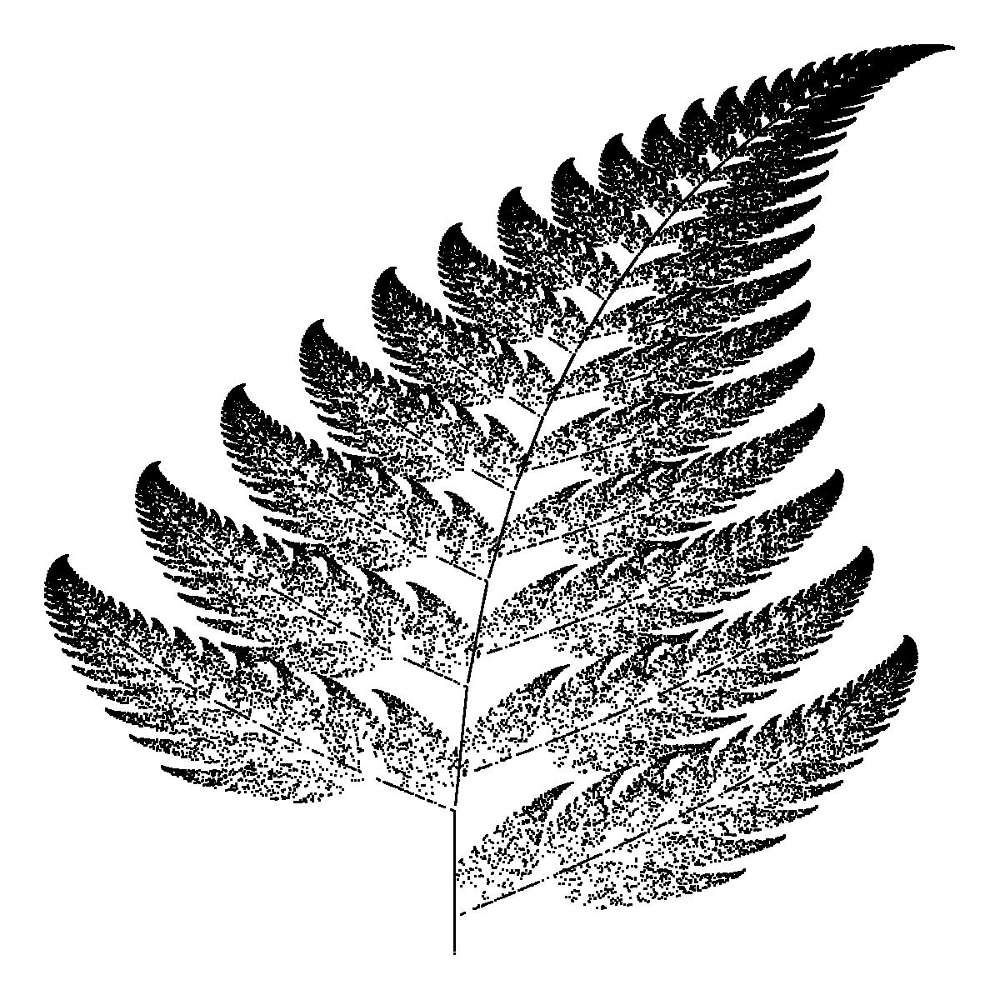

```{r, message = F}
library(tidyverse)
```

# Introduction
In this script, I implement the so-called *choas game* to generate fractals. I decided to write this script after watching a tutorial video by Numberphile on the topic. I found the chaos game fascinating and wanted to implement it on R Studio. I also wanted to generalize this method to be able to generate other types of fractal.

## Fractals
Fractals are complex mathematical objects. In this script, it is sufficient to understand them as geometric figures whose parts are reduced-size copies of the whole. That is, given a fractal, if we zoom in on any of its parts, we find the exact same patterns as in the original figure, no matter how much we zoom in. One of the most famous fractals in mathematics is the Sierpinski Triangle.

{height=250px, width=250px}

## The Chaos Game
The 8-minute [tutorial](https://www.youtube.com/watch?v=kbKtFN71Lfs) *Chaos Game* by Numberphile does a much better job at explaining the choas game than I possibly could, so I recommend the reader to simply watch it to understand how the method works. To generate the Sierpinski Gasket with the chaos game, we follow 5 steps:

1. Take three points in a plane. These will be the vertices of the final fractal.
2. Choose a point in the plane and draw it.
3. Randomly choose a vertex.
4. Draw the point half distance between the current point and the chosen vertex.
5. Repeat from step 3.

## Outline of Script
I kick off this script with a well-know fractal: the Sierpinski Gasket. I write a function that uses the chaos game to generate it and then experiment with the parameters to vary the shape and patterns of the obtained figure I then generalize the function to generate fractals with any number of vertices before finishing the script with an adaptation of the chaos game that generates Barnsley Fern, another beautiful fractal.

# Sierpinski Gasket and Other Triangular Fractals

## The Function `generate_sg()`
We design the function `generate_sg()` that uses the chaos game to generate a Sierpinski Gasket.

```{r generate_sg}
generate_sg <- function(
  
  # Number of iterations. A large n produces sharp patterns.
  n = 1e4,
  
  # Coordinates of the vertices. The defaults values produce an equilateral triangle.
  v1 = c(0,0), v2 = c(1, 0), v3 = c(0.5, sqrt(3)/2), 
  
  # How close to the previous point the new point is. Must be comprised between 0 and 1.
  p = 0.5,        
  
  # Coordinates of the initial point.
  initial_point = v1, 
  
  # Title and subtitle of the plot.
  title    = NULL, 
  subtitle = NULL
  
  ){
  
  #
  # Setup
  points         <- data.frame(x = numeric(0), y = numeric(0))
  point_previous <- initial_point
  
  #
  # Chaos Game
  for(i in 1 : n){
    
    # Choose a vertex at random
    vertex         <- sample(list(v1, v2, v3), size = 1)[[1]]
    
    # Draw the new point
    point_new      <- p       * point_previous +
                      (1 - p) * vertex
    points[i, ]    <- point_new
    point_previous <- point_new
    
  }
  
  #
  # Plot
  g <- ggplot(points, aes(x, y)) +
    geom_point(shape = ".") +
    labs(title = title, subtitle = subtitle) + 
    theme_void() +
    theme(plot.title    = element_text(hjust = 0.5),
          plot.subtitle = element_text(hjust = 0.5))
  
  # Save and return plot
  ggsave(paste("Triangular Fractal with p =", p, ".jpeg"),
         width = 4, height = 2 * sqrt(3), path = "Plots")
  return(g)
  
}
```

We can simplify the loop of the function `generate_sg` to speed it up.

```{r generate_sg fast}
generate_sg <- function(n = 1e4, v1 = c(0,0), v2 = c(1, 0), v3 = c(0.5, sqrt(3)/2), 
                        p = 0.5, initial_point = v1, title = NULL, subtitle = NULL){
  
  points      <- data.frame(x = numeric(0), y = numeric(0))
  points[1, ] <- initial_point
  
  #
  # Faster loop
  for(i in 1 : n){
    
    points[i + 1, ] <-      p  * points[i, ] +
                       (1 - p) * sample(list(v1, v2, v3), size = 1)[[1]]
    
  }

  g <- ggplot(points, aes(x, y)) +
    geom_point(shape = ".") +
    labs(title = title, subtitle = subtitle) + 
    theme_void() +
    theme(plot.title    = element_text(hjust = 0.5),
          plot.subtitle = element_text(hjust = 0.5))
  
  ggsave(paste("Triangular Fractal with p =", p, ".jpeg"),
         width = 4, height = 2 * sqrt(3), path = "Plots")
  return(g)
  
}
```

With its default arguments, the function `generate_sg()` produces the Sierpinski Gasket.

```{r sg default, fig.height = 3, fig.width = 3, fig.align = 'center', cache = TRUE}
generate_sg(title = "Sierpinski Gasket", subtitle = "(10,000 iterations)")
```


## Other Triangular Fractals
We can generate triangular fractals with various shapes and patterns by varying the parameters of the function `generate_sg()`. First, by changing the value of `p`, we generate fractals with different patterns.

```{r sg p, fig.height = 1, fig.width = 2, fig.align = 'center', cache = TRUE}
for(p in c(0.1, 0.2, 0.3, 0.45, 0.5, 0.55, 0.7, 0.8, 0.9, 0.95))
  
  print(generate_sg(p = p, subtitle = paste("p =", p)))
```

It seems that for `p` superior to `0.5`, larger values give figures that are more chaotic. 

Second, we can also randomly determine the location of the vertices to obtain different triangular figures.

```{r sg v, fig.height = 2, fig.width = 3, fig.align = 'center', cache = TRUE}
set.seed(123)
generate_sg(v1 = runif(2), v2 = runif(2), v3 = runif(2), subtitle = "Vertices randomly located")

set.seed(124)
generate_sg(v1 = runif(2), v2 = runif(2), v3 = runif(2), subtitle = "Vertices randomly located")

set.seed(125)
generate_sg(v1 = runif(2), v2 = runif(2), v3 = runif(2), subtitle = "Vertices randomly located")
```

Third, by increasing the number of iterations, we generate a figure with a sharper pattern.

```{r sg n, fig.height = 2, fig.width = 3, fig.align = 'center', cache = TRUE}
set.seed(125)
generate_sg(v1 = runif(2), v2 = runif(2), v3 = runif(2),
            n = 1e5,
            title = "Sierpinski Gasket", subtitle = "(100,000 iterations)")
```

Finally, changing the location of the initial point does not significantly alter the outcome: the sequence of points rapidly follows the regular pattern.

```{r sg i_p, fig.height = 2, fig.width = 3, fig.align = 'center', cache = TRUE}
set.seed(125)
generate_sg(v1 = runif(2), v2 = runif(2), v3 = runif(2),
            initial_point = c(3, 3),
            subtitle = "Initial point located outisde of vertices")
```


# General Formula

## The Function
One could also be interested in generating fractals with more vertices. The function `generate_fractal()` is a generalization of `generate_sg()` that produces fractals with any number of vertices. It has the same arguments as `generate_sg()` at the exception of:

* `k` determines the number of vertices of the fractal.

* `x` and `y` determine the x- and y-coordinates of the fractal's vertices. If the arguments `x` and `y` are left to `NULL`, then the coordinates are randomly generated.

```{r generate_fractal}
generate_fractal <- function(n = 1e4, k = 4, x = NULL, y = NULL, p = 0.5, title = NULL, subtitle = NULL){
  
  if(is.null(x)){ x <- runif(k)}
  if(is.null(y)){ y <- runif(k)}
  
  points <- data.frame(x = numeric(0), y = numeric(0))
  
  point <- c(x[1], y[1])
  
  for(i in 1:n){
    
    m      <- sample(1 : length(x), size = 1)
    vertex <- c(x[m], y[m])
    point  <- p       * point +
              (1 - p) * vertex
    
    points[i, ] <- point
    
  }
  
  g <- ggplot(points, aes(x, y)) +
    geom_point(shape = ".") +
    labs(title = title, subtitle = subtitle) + 
    theme_void() +
    theme(plot.title = element_text(hjust = 0.5),
          plot.subtitle = element_text(hjust = 0.5))
    
  ggsave(paste("k =", k, "and p =", p, ".jpeg"), width = 4, height = 4, path = "Plots")
  return(g)
  
}
```

## Experimenting

With its parameters left to their default value, the function generates a quadrilateral figure with its vertices randomly located.

```{r fractal default, fig.height = 2, fig.width = 3, fig.align = 'center', cache = TRUE}
set.seed(123)
generate_fractal()
```

By fixing the vertices, we can generate a square fractal.
```{r fractal square, fig.height = 2, fig.width = 2, fig.align = 'center', cache = TRUE}
generate_fractal(x = c(0,0,1,1), y = c(0,1,0,1))
```

Surprisingly, unlike the previous quadrilateral figure, the square fractal does not contain any clear pattern. Yet, as with triangular fractals, varying the value of `p` changes the patterns of the obtained figure.

```{r fractal p, fig.height = 1, fig.width = 1, fig.align = 'center', cache = TRUE}
for(p in c(0.1, 0.2, 0.3, 0.45, 0.49, 0.5, 0.55, 0.7, 0.9))
  
  print(generate_fractal(x = c(0,0,1,1), y = c(0,1,0,1),     
                         p = p, subtitle = paste("p =", p)))
```

It seems that for square fractals, values of `p` equal or superior to `0.5` generates figures with no apparent pattern.

Changing the value of the argument `k` generates fractals with different numbers of vertices.

```{r fractal k, fig.height = 2, fig.width = 3, fig.align = 'center', cache = TRUE}
ks    <- c(3  , 4   , 5  , 7   )
seeds <- c(1  , 12  , 121, 241 )
ps    <- c(0.5, 0.45, 0.4, 0.35)

for(i in 1:length(ks)){
  
  k    <- ks[i]
  seed <- seeds[i]
  p    <- ps[i]
  
  set.seed(seed)
  
  print(generate_fractal(k = k, p = p,
                         title    = paste("Fractal with", k, "Vertices"),
                         subtitle = paste("p =", p)))

}
```

# Bonus: Barnsley Fern
I want to conclude this script with an adaptation of the chaos game that generates the so-called Barnsley Fern (in my opinion one of the most beautiful fractals there is.). Note how each leaf of the fern is a fern itself.

{width=250px, height=250px}

## The Function
The function `generate_bf()` uses an adaptation of the chaos game to generate a Barnsley Fern. The iterative mechanism of `generate_bf()` is fundamentally the same as that of `generate_fractal()` and `generate_sg()`: given a point, we randomly apply to its coordinates a transformation from a given set to generate the next point. For the function `generate_bf()`, we apply one of four affine transformations. These four transformation are captured in the four rows of the matrices `M1` and `M2`. I obtained the values for the entries of these matrices from Mr. Barnsley's book `Fractals Everywhere` (p.86, table III.3. *IFS code for a fern*). For clarity, I decided to split the table from Mr. Barnsley's book into two matrices. The function `generate_bf()` has the same arguments as `generate_sg()` and `generate_fractal()` at the exception of:

* `proba` gives the probability of applying each of the `4` transformations to the point. Each transformation has an associated element on the plot: the stem, the leaves' end, the fern's left-hand side and the fern's right-hand side.

```{r, generate_bf}
generate_bf <- function(n = 1e4, proba = c(0.01, 0.85, 0.07, 0.07), title = NULL, subtitle = NULL){
  
  M1 <- matrix(
    c(0    , 0    , 0    , 0.16,
      0.85 , 0.04 , -0.04, 0.85,
      0.20 , -0.26, 0.23 , 0.22,
      -0.15, 0.28 , 0.26 , 0.24),
    byrow = TRUE, 
    ncol = 4
    )

  M2 <- matrix(
    c(0, 0   ,
      0, 1.60,
      0, 1.60,
      0, 0.44),
    byrow = TRUE, 
    ncol = 2)
  
  points <- data.frame(x = numeric(0), y = numeric(0))
  
  point <- c(0, 0)
  
  
  for(i in 1 : n){
    
    k           <- sample(1 : 4, size = 1, prob = proba)
    point       <- matrix(M1[k, ], byrow = T, ncol = 2) %*% point + M2[k, ]
    points[i, ] <- point
    
  }
  
  g <- ggplot(points, aes(x, y)) +
    geom_point(shape = ".") +
    labs(title = title, subtitle = subtitle) + 
    theme_void() +
    theme(plot.title    = element_text(hjust = 0.5),
          plot.subtitle = element_text(hjust = 0.5))
    
  
  ggsave("Barnsley Fern.jpeg", width = 3, height = 3, path = "Plots")
  return(g)
  
}
```

With its parameters left to their default value, the function generates Barnsley Fern.

```{r bf default, fig.height = 2, fig.width = 2.5, fig.align = 'center'}
generate_bf(title = "Barnsley Fern", subtitle = "10,000 iterations")
```

## Experimenting
Changing the probabilities in `proba` changes the distribution of the points among the different elements of the fern (stem, leaves' end, and left- and right-hand sides). If we set one of the elements of `proba` to `0`, it leaves the associated element of the fern blank.

```{r bf proba I, fig.height = 2, fig.width = 2.5, fig.align = 'center', cache = TRUE}

proba     <- c(0.01, 0.85, 0.07, 0.07)
subtitles <- c("1st element of `proba` is null: blank stem"           ,
               "2nd element of `proba` is null: no result",
               "3rd element of `proba` is null: blank left-hand side",
               "4th element of `proba` is null: blank right-hand side")

for(i in 1:4){
  
  proba_blank    <- proba
  proba_blank[i] <- 0
  subtitle       <- subtitles[i]
  
  print(generate_bf(proba    = proba_blank,
                    title    = "Barnsley Fern",
                    subtitle = subtitle))
  
}
```

On the contrary, if we increase the value of an element of `proba`, we make the associated element of the fern more pronounced.

```{r bf proba II, fig.height = 2, fig.width = 2.5, fig.align = 'center', cache = TRUE}
m <- 3
proba     <- c(0.01, 0.85, 0.07, 0.07)
subtitles <- c("1st element of `proba` is increased: stem more pronounced"           ,
               "2nd element of `proba` is increased: leaves' ends more pronounced"  ,
               "3rd element of `proba` is increased: left-hand side more pronounced",
               "4th element of `proba` is increased: right-hand side more pronounced")

for(i in 1:4){
  
  proba_blank    <- proba
  proba_blank[i] <- proba_blank[i] * m
  subtitle       <- subtitles[i]
  
  print(generate_bf(proba    = proba_blank,
                    title    = "Barnsley Fern",
                    subtitle = subtitle))
  
}
```

# Summary
I designed three functions `generate_sg()`, `generate_fractal()` and `generate_bf()` that respectively generate the Sierpinski Gasket, fractals with any number of vertices and the Barnsley Fern. Each function has parameters that allow us to tweak the shape and pattern of the obtained fractal. Most important is the argument `p` of the functions `generate_sg` and `generate_fractal` which determines whether the figure is a fractal with a clear pattern or a chaotic  bunch of points.